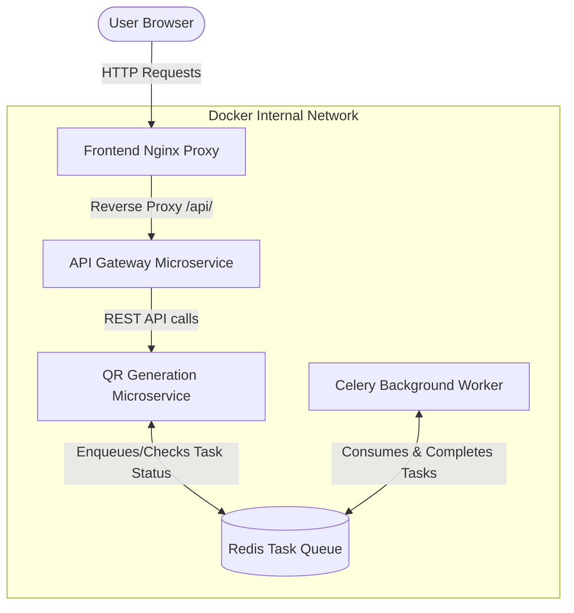

# QR Code Generator Project

## Description:

This project is a client-server web application designed to instantly craft beautiful QR codes for any text or link input. It features a premium "Dark Mode" aesthetic frontend built with Vanilla JavaScript, HTML, and CSS. The backend has been structured into a robust microservices architecture using Python and Flask. It consists of an **API Gateway** that authenticates and routes requests, and a dedicated **QR Service** utilizing the `qrcode` library to generate and return the QR code image. The entire application is containerized using Docker and orchestrated with Docker Compose.

## Architecture Diagram:

The following is a representation of the system architecture using Mermaid JS syntax. You can view this diagram using any Markdown renderer that supports Mermaid.

