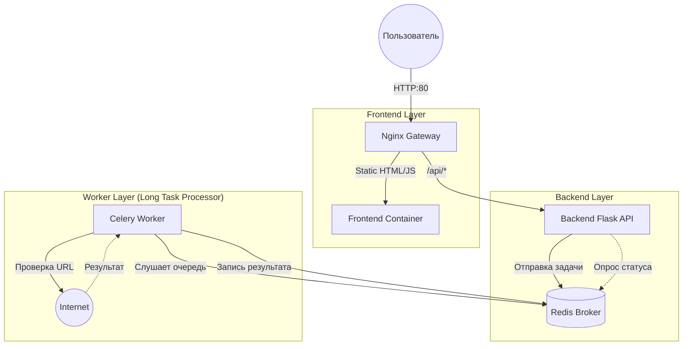

# 🌐 URL Checker (Microservices Project)

Сервис для проверки доступности веб-сайтов, построенный на микросервисной архитектуре с использованием Docker.

## 🏗 Архитектура системы

Проект разделен на независимые слои для обеспечения отказоустойчивости и возможности масштабирования.



## 🛠 Технологический стек
- Gateway: Nginx (Reverse Proxy)
- Frontend: HTML5 / JavaScript (Vanilla) / Nginx
- Backend: Python 3.11 / Flask / Gunicorn (WSGI)
- Task Queue: Celery + Redis
- Worker: Python 3.11 / Requests
- Orchestration: Docker Compose

## 🚀 Быстрый запуск
Все компоненты запускаются одной командой из корневой директории `GornyhIS`

```bash
docker compose up --build
```

После запуска приложение доступно по адресу: 
```text
http://localhost
```

## 📂 Структура проекта
```text
/backend — API для приема заявок и отдачи статуса задач.
/worker — Сервис, выполняющий реальные HTTP-запросы.
/frontend — Простой UI для взаимодействия с пользователем.
nginx.conf — Правила маршрутизации трафика.
docker-compose.yml — Описание связи всех контейнеров.
```

## 📝 Как это работает
- Пользователь вводит URL в браузере.
- Frontend отправляет POST-запрос на /api/check.
- Backend генерирует task_id, кладет задачу в Redis и сразу возвращает ID пользователю.
- Worker подхватывает задачу из Redis, идет на указанный сайт и сохраняет результат обратно в Redis.
- Frontend короткими опросами (polling) спрашивает у Backend статус задачи по ее ID, пока не получит ответ.